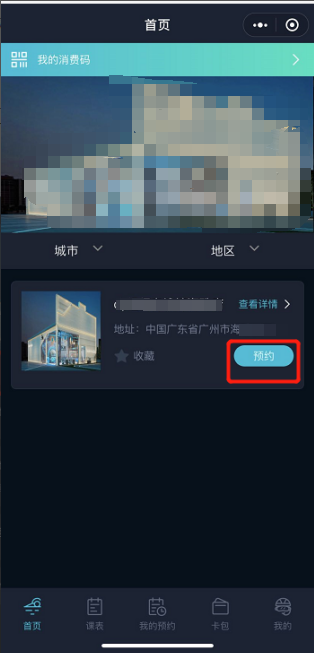
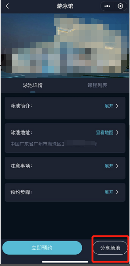
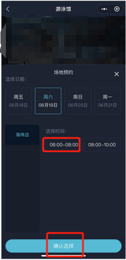
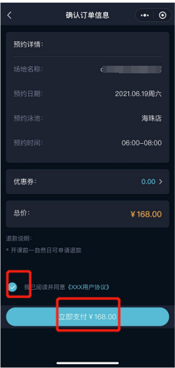
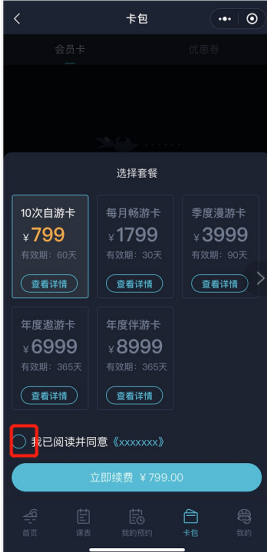
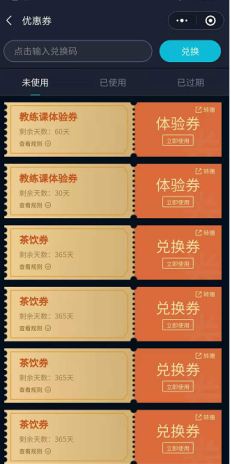
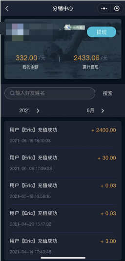
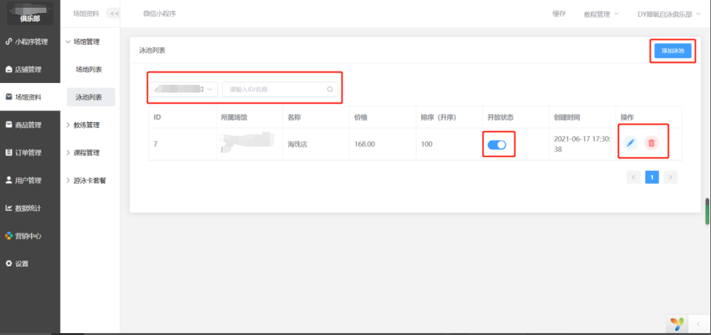
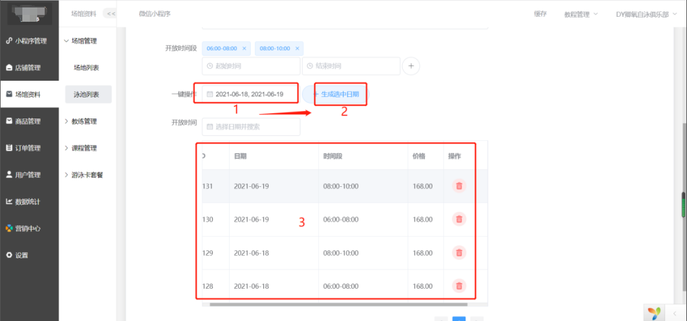
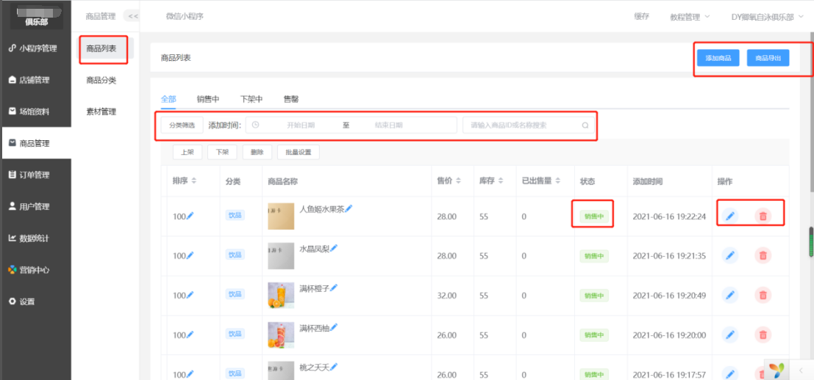

## 项目介绍

`场馆会员卡管理系统`是一个全面管理健身馆、游泳馆等体育场馆的会员的工具，旨在提供便捷、高效的会员管理服务。该系统集成了多项功能，使健身游泳场所能够更好地管理会员信息、课程安排、收费、以及提供更好的服务体验。
后台使用PHP语言，使用Yii2框架，前端为小程序端，使用uniapp多端开发框架。
该系统采用直观易用的界面设计，支持多平台访问，包括网页版和移动应用，让会员和管理人员都能随时随地方便地使用系统功能。
通过这些功能，健身游泳会员卡管理系统帮助健身游泳场所提高管理效率、提升会员满意度，并更好地满足不同会员的健身需求。

## 系统功能列表

| 系统功能  |
|-------|
| 场地管理  |
| 课程管理  |
| 预约管理  |
| 会员卡管理 |
| 会员管理  |
| 充值管理  |
| 优惠券管理 |
| 分销管理  |
| 订单管理  |
| 角色管理  |
| 数据分析  |
| 系统管理  |

## 技术选型

### 后端技术

| 技术                   | 说明                 |
|----------------------| -------------------- |
| Yii2                 | MVC框架         |
| Redis                | 分布式缓存           |
| Docker               | 应用容器引擎         |
| OSS                  | 对象存储             |

### 前端技术

| 技术     | 说明     | 官网                           |
|--------|--------| ------------------------------ |
| Vue    | 后台前端框架 | https://vuejs.org/             |
| uniapp | 小程序端框架 | https://uniapp.dcloud.net.cn/       |

## 环境搭建

### 开发环境

| 工具    | 版本号  |
|-------|------|
| PHP   | 7.3  |
| Mysql | 5.7  |
| Redis | 7.0  |
| nginx | 1.22 |

## 运行效果展示

### 小程序端

- 首页

- 预约

- 会员卡

- 优惠券

- 分销

- 后台管理

### 技术支持或联系获取源码
请加QQ: 1062280320

